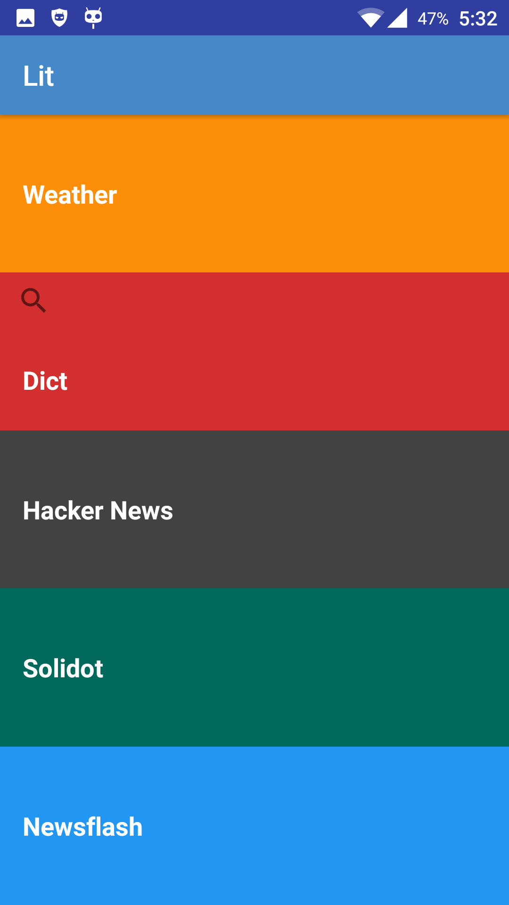

#	Lit 

**Lit** is a Lite Info Toolkit. It's like some kind of RSS reader with weather-and-dict query feature.

Basically this collection of tools were written in Python and used on PC. Since a handy is more handy so I made it to **Lit**. 

##	Installation

The installer is located in the **`Lit/installer/`** folder. 

Lit is about the size of 1.4MB and needs access to network. 

##	Layout

<table>
<tr>
<td>
</td>
<td></td>
<tr>
</table>

##	Features

*	Weather

	Fetch the weather of today and tomorrow, plus Air Quality Index. Currently it is hard-coded and can only fetch info of Hangzhou from [中国天气网](http://m.weather.com.cn/). Try to change the city-code in `Lit/app/src/main/java/io/github/jjayyyyyyy/lit/MainActivity.java` to display the weather of your own city.

*	Dict

	Translate the CN to/from EN.

*	Hacker News

	Fetch the first page titles of [Hacker News](https://news.ycombinator.com/)

*	Solidot

	Fetch the first page titles of [Solidot](http://www.solidot.org/)
	
*	Newsflash

	Fetch the first page titles of [36kr Newsflash](http://36kr.com/newsflashes)

##	Mobile Traffic Consumption

Approximate mobile traffic consumption of each query is list below.

| query | traffic |
| :----- | :------- |
| Weather | 20 KB | 
| Dict | 1 KB | 
| Hacker News | 8 KB | 
| Solidot | 30 KB | 
| weather | 20 KB | 

##	Reference

*	[Udacity, Android Basics](https://www.udacity.com/courses/android)
*	[Android Devloper Doc](https://developer.android.com/index.html)
*	[Common_Android_Views_Cheat_Sheet](http://cn-static.udacity.com/nd801/Common_Android_Views_Cheat_Sheet.pdf)
*	[Material Design](https://material.io/)
*	[Oracle Docs, Class Pattern](http://docs.oracle.com/javase/7/docs/api/java/util/regex/Pattern.html)
*	[TutorialsPoint, Java Regex](https://www.tutorialspoint.com/java/java_regular_expressions.htm)
*	[TutorialsPoint, Android JSON Parser](https://www.tutorialspoint.com/android/android_json_parser.htm)
*	[CuriousConcept, json formatter](https://jsonformatter.curiousconcept.com/)
*	[CSDN leesren, Java正则表达式转义](http://blog.csdn.net/csr0312/article/details/17016709)
*	[Stack Overflow, Android disable landscpe mode](http://stackoverflow.com/a/582585/5584850)
*	[Shields, make badge](http://shields.io/)